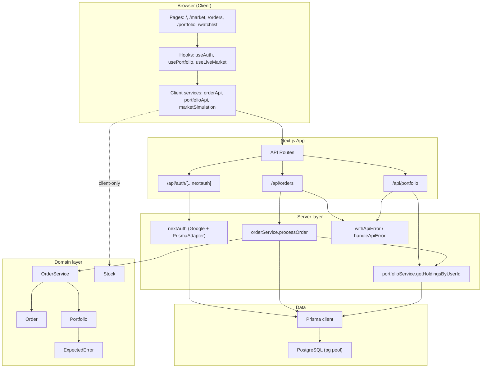
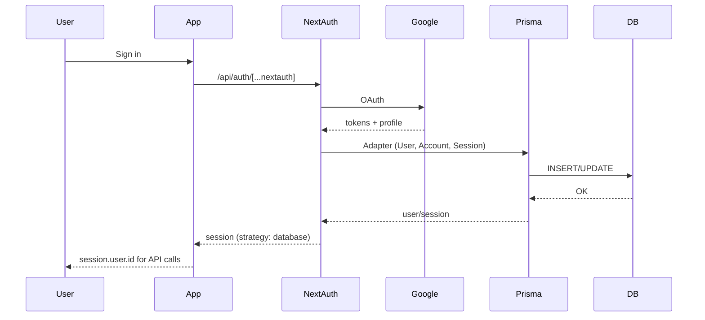
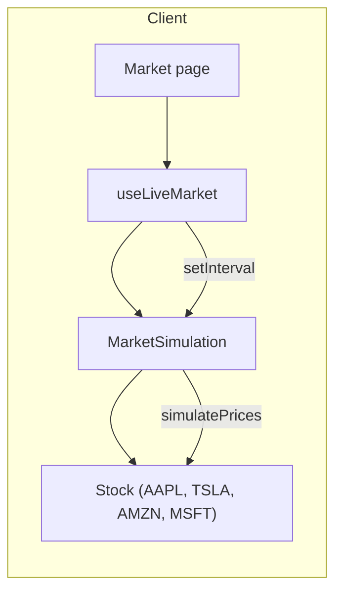

# Trading Web — System Diagram

## 1. High-level architecture



---

## 2. Authentication flow



- **Provider:** Google (via `GOOGLE_ID`, `GOOGLE_SECRET`).
- **Adapter:** `PrismaAdapter` → User, Account, Session stored in PostgreSQL.
- **Session:** database strategy; `session.user.id` set in callback for API auth.

---

## 3. Order flow (place order)

```mermaid
sequenceDiagram
    participant OrdersPage
    participant orderApi
    participant API
    participant orderService
    participant OrderService
    participant Portfolio
    participant Prisma
    participant DB

    OrdersPage->>orderApi: placeOrder({ symbol, quantity, type, price })
    orderApi->>API: POST /api/orders (session cookie)
    API->>API: getServerSession → userId
    API->>API: orderSchema.parse(body)
    API->>orderService: processOrder(userId, order)

    orderService->>Prisma: holding.findMany(userId)
    Prisma->>DB: SELECT
    DB-->>Prisma-->>orderService: existingData

    orderService->>OrderService: execute(holdings, Order)
    OrderService->>Portfolio: new Portfolio(holdings)
    alt BUY
        Portfolio->>Portfolio: addStock(symbol, quantity, price)
    else SELL
        Portfolio->>Portfolio: removeStock(symbol, quantity)
    end
    Portfolio-->>OrderService: getHoldings()
    OrderService-->>orderService: newHoldings

    orderService->>Prisma: $transaction([deletes, updates, creates])
    Prisma->>DB: DELETE/UPDATE/INSERT
    DB-->>Prisma-->>orderService: OK

    orderService->>orderService: getHoldingsByUserId(userId)
    orderService-->>API: holdings
    API-->>orderApi: { holdings }
    orderApi-->>OrdersPage: success
```

- **Validation:** `orderSchema` (Zod) in API; client uses live market for price and symbol.
- **Domain:** `Order` + `OrderService` + `Portfolio` (pure logic); server `orderService` does persistence.

---

## 4. Portfolio flow (read holdings)

```mermaid
sequenceDiagram
    participant PortfolioPage
    participant usePortfolio
    participant portfolioApi
    participant marketSimulation
    participant API
    participant portfolioService
    participant Prisma
    participant DB

    PortfolioPage->>usePortfolio: usePortfolio(intervalMs)
    usePortfolio->>portfolioApi: fetchHoldings()
    portfolioApi->>API: GET /api/portfolio (session cookie)
    API->>API: getServerSession → userId
    API->>portfolioService: getHoldingsByUserId(userId)
    portfolioService->>Prisma: holding.findMany(userId)
    Prisma->>DB: SELECT
    DB-->>Prisma-->>portfolioService: holdings
    portfolioService-->>API: Holding[]
    API-->>portfolioApi: { holdings }
    portfolioApi-->>usePortfolio: holdings

    usePortfolio->>marketSimulation: getStock(symbol) → currentPrice
    usePortfolio->>usePortfolio: rows = holdings + currentPrice + profitLoss
    usePortfolio-->>PortfolioPage: { rows, error }

    loop every intervalMs
        usePortfolio->>marketSimulation: simulatePrices()
        usePortfolio->>portfolioApi: fetchHoldings()
        usePortfolio-->>PortfolioPage: updated rows
    end
```

- **Portfolio data:** from API (DB); **current price / P&amp;L:** from client-side `MarketSimulation` (no DB).

---

## 5. Market (client-only simulation)



- **No server/DB:** prices live in memory; `MarketSimulation` runs in the browser and drives Market page and (via `usePortfolio`) Portfolio P&amp;L.

---

## 6. Layer overview

| Layer        | Location              | Responsibility |
|-------------|------------------------|----------------|
| **Pages**   | `src/app/**/page.tsx`  | Routes: home, market, orders, portfolio, watchlist |
| **Client**  | `src/client/`          | Hooks, services (orderApi, portfolioApi, marketSimulation), layouts, error UI |
| **API**     | `src/app/api/`         | Auth check, validation (Zod), call server services, `withApiError` |
| **Server**  | `src/server/`          | orderService, portfolioService, nextAuth, validation, errors, db |
| **Domain**  | `src/domain/`          | Order, OrderService, Portfolio, Stock, ExpectedError (pure logic) |
| **Shared**  | `src/shared/`          | Types (portfolio, next-auth), used by client + server |
| **Data**    | `prisma/schema.prisma` | User, Account, Session, Holding; Prisma + PostgreSQL |

---

## 7. Database (Prisma schema)

```mermaid
erDiagram
    User ||--o{ Account : has
    User ||--o{ Session : has
    User ||--o{ Holding : has

    User {
        string id PK
        string name
        string email UK
        datetime emailVerified
        string image
    }

    Account {
        string id PK
        string userId FK
        string type
        string provider
        string providerAccountId
    }

    Session {
        string id PK
        string sessionToken UK
        string userId FK
        datetime expires
    }

    Holding {
        string id PK
        string userId FK
        string symbol
        int quantity
        float avgPrice
    }

    User Account : "1..*"
    User Session : "1..*"
    User Holding : "1..*"
```

- **Unique:** `(userId, symbol)` on `Holding`.
- Auth: NextAuth uses User, Account, Session; app uses `session.user.id` for portfolio/orders.

---

## 8. File map (key entrypoints)

| Concern        | Files |
|----------------|-------|
| **Auth**       | `src/server/auth/nextAuth.ts`, `src/app/api/auth/[...nextauth]/route.ts`, `src/client/hooks/useAuth.ts`, `src/client/components/layouts/AuthButton.tsx` |
| **Orders**     | `src/app/api/orders/route.ts`, `src/server/orders/orderService.ts`, `src/client/services/orderApi.ts`, `src/domain/orders/Order.ts`, `OrderService.ts` |
| **Portfolio**  | `src/app/api/portfolio/route.ts`, `src/server/portfolio/portfolioService.ts`, `src/client/services/portfolioApi.ts`, `src/client/hooks/usePortfolio.ts`, `src/domain/portfolio/Portfolio.ts` |
| **Market**     | `src/client/services/marketSimulation.ts`, `src/client/hooks/useLiveMarket.ts`, `src/domain/market/Stock.ts` |
| **API errors** | `src/server/api/errors.ts` (`withApiError`, `handleApiError`, ApiError, Zod, ExpectedError) |
| **DB**         | `prisma/schema.prisma`, `src/server/db/prisma.ts` (Prisma + pg Pool) |

This document reflects the codebase as of the last review; update it when adding routes, services, or schema changes.
